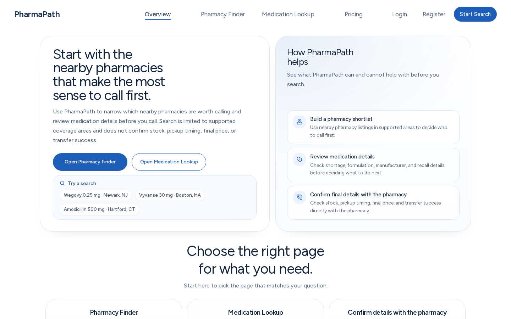

# PharmaPath

  

  

Public guide for PharmaPath, a medication and pharmacy-pathway tool.

**Live:** [https://pharmapath.org](https://pharmapath.org)

**Status:** Live public product surface.

## What It Does

- Helps users review medication and pharmacy-pathway context from the public product surface.
- Frames the next outreach step while leaving final stock, timing, pricing, substitutions, and care decisions to pharmacies and clinicians.
- Keeps public documentation focused on use, scope, boundaries, and support.

## Who It Is For

People comparing medication-access next steps before contacting pharmacies or care teams.

## Key Features

- Medication context
- Pharmacy-pathway guidance
- Call preparation
- Public product updates

## Public Docs

- [Overview](docs/overview.md)
- [Getting started](docs/getting-started.md)
- [FAQ](docs/faq.md)
- [Data handling](docs/data-handling.md)
- [Changelog](CHANGELOG.md)
- [Security](SECURITY.md)
- [Contributing](CONTRIBUTING.md)

## Privacy And Source Code

Production source code, private implementation details, secrets, internal routes, proprietary logic, and non-public data are intentionally omitted. This repository documents only the public product surface, safe usage notes, and support paths.

## Contact

- Website: [https://dylanwlim.com](https://dylanwlim.com)
- GitHub: [https://github.com/dylanwlim](https://github.com/dylanwlim)
- Email: [dylan@wlim.work](mailto:dylan@wlim.work)
