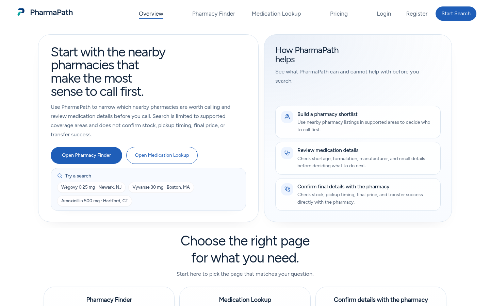

# PharmaPath

  

A guide to PharmaPath, which helps users organize medication and pharmacy-pathway context before contacting pharmacies or care teams.

**Live site:** [https://pharmapath.org](https://pharmapath.org)

**Status:** Live medication and pharmacy-pathway product.

## Start Here

- [Product guide](product-guide.md)
- [How it works](how-it-works.md)
- [Setup and access](setup.md)
- [FAQ](faq.md)
- [Security and privacy](security-and-privacy.md)
- [Roadmap](roadmap.md)
- [Changelog](changelog.md)
- [Testing guide](testing.md)
- [Contributing](CONTRIBUTING.md)
- [Community conduct](CODE_OF_CONDUCT.md)

## What You Can Do

- Medication context
- Pharmacy-pathway guidance
- Call preparation
- Product updates

## Who It Helps

People comparing medication-access next steps before contacting pharmacies or clinicians.

## Get Help

Use the public [bug report](https://github.com/dylanwlim/pharmapath-docs/issues/new?template=bug.yml) or [feature request](https://github.com/dylanwlim/pharmapath-docs/issues/new?template=feature.yml) forms for non-sensitive feedback. Email [support@pharmapath.org](mailto:support@pharmapath.org) for general help or [security@pharmapath.org](mailto:security@pharmapath.org) for security and private-data concerns.
