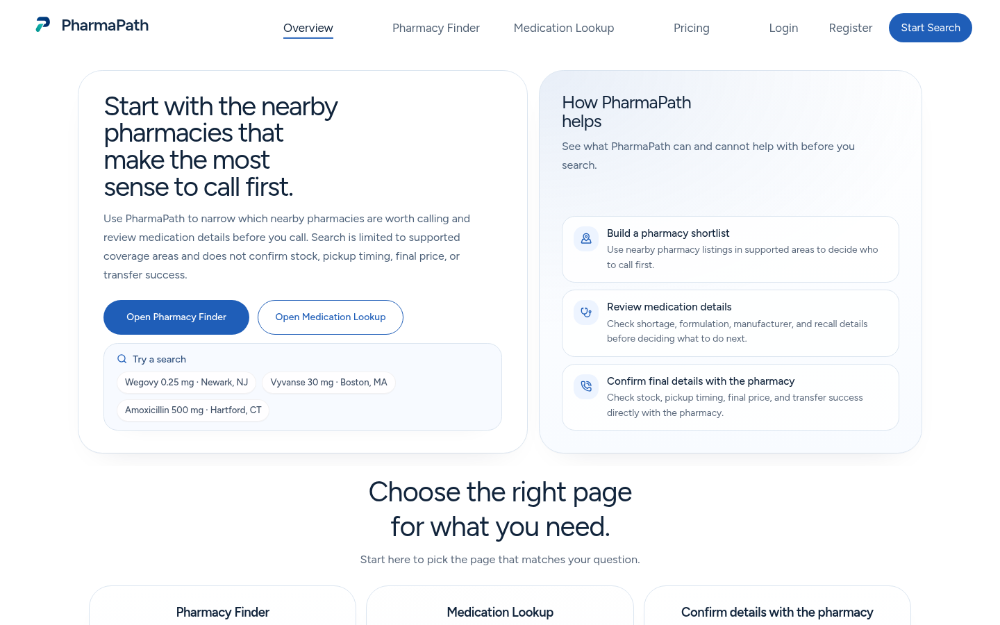

# PharmaPath

Find pharmacies to contact and review medication information before your next call.

**[Open PharmaPath](https://pharmapath.org)** · [Quick start](setup.md) · [User guide](product-guide.md) · [Help](faq.md)

  

## What you can do

- Build a shortlist of nearby pharmacies in supported areas.
- Review medication details and shortage information.
- Save a watchlist and manage your notification preferences.

Confirm availability, price, insurance, and pickup timing directly with the pharmacy. PharmaPath provides information to help you prepare; it does not provide medical advice or guarantee stock.

## Guides and support

| Guide | Find what you need |
| --- | --- |
| [Quick start](setup.md) | Open the site, search, and sign in. |
| [User guide](product-guide.md) | Choose a search and prepare your pharmacy call. |
| [Help and FAQ](faq.md) | Understand results and troubleshoot common problems. |
| [Privacy and your data](security-and-privacy.md) | Manage your account data and get private help. |

[Report a problem](https://github.com/dylanwlim/pharmapath-docs/issues/new?template=bug.yml) · [Suggest an improvement](https://github.com/dylanwlim/pharmapath-docs/issues/new?template=feature.yml) · [Contact support](mailto:support@pharmapath.org)

See [feedback guidelines](CONTRIBUTING.md) and [community conduct](CODE_OF_CONDUCT.md).
